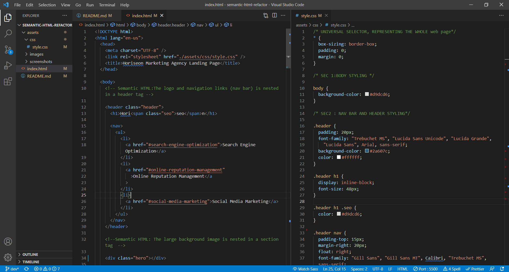

# semantic-html-refactor

## Description:

Refactoring existing code without changing the design and functionality of the web application by mainly using semantic HTML and CSS.

## Refactoring Tasks Completed:

- Added an appropriate and descriptive document title
- Utilized semantic-Html tags like main, aside, article etc in appropriate places
- Fixed the bug that existed in the "Search Engine Optimization" nav-link
- Added web accessibility elements and attributes like figcaption and alt in appropriate places
- Changed the selector classes in CSS to target the correct refactored HTML tags
- Combined numerous class selectors in CSS to reduce any duplication

## Preview Image Of Code:

## Preview Image Of Web-page:

## Complete Project:

To see the full deployed web-page project <a href="google.com">click here </a>
